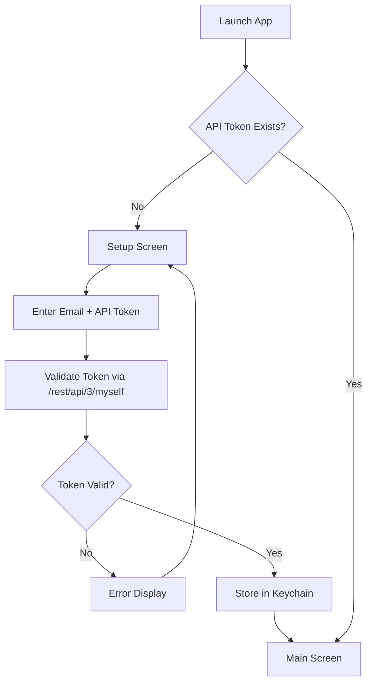

# Product Details

## User Workflows

### Application Flow



### First-Time Setup

Users without a stored Jira API token see the setup screen:

```
┌─────────────────────────────────────────────────────────────────────────┐
│                                                                         │
│                           ╔═══════════════════╗                         │
│                           ║    gojira-tmux    ║                         │
│                           ╚═══════════════════╝                         │
│                                                                         │
│                         First-Time Setup                                │
│                                                                         │
│         ┌─────────────────────────────────────────────┐                 │
│         │                                             │                 │
│         │   Jira API Token not configured.            │                 │
│         │                                             │                 │
│         │   To generate a token:                      │                 │
│         │   1. Visit id.atlassian.com/manage-profile  │                 │
│         │   2. Go to Security > API tokens            │                 │
│         │   3. Create and copy your token             │                 │
│         │                                             │                 │
│         │   Enter Jira API Token: _______________     │                 │
│         │                                             │                 │
│         └─────────────────────────────────────────────┘                 │
│                                                                         │
│         Token will be stored securely in system keychain                │
│         Press Esc to cancel                                             │
│                                                                         │
└─────────────────────────────────────────────────────────────────────────┘
```

## Main Screen Layout

```
┌─────────────────────────────────────────────────────────────────────────┐
│  [Project ▼]          [Member ▼]           [Status ▼]                   │
│   -All-                -All-                All                         │
├─────────────────────────────────────────────────────────────────────────┤
│ ● │ Key      │ Summary            │ Status  │ Assignee │ Pri  │ Due    │
│───┼──────────┼────────────────────┼─────────┼──────────┼──────┼────────│
│ 🔴│ PROJ-123 │ Fix login bug      │ Open    │ J.Doe    │ High │ 01/15  │
│ 🟡│ PROJ-124 │ Add dark mode      │ Open    │ J.Smith  │ Med  │  --    │
│   │ PROJ-125 │ Update docs        │ Ready   │ B.Wilson │ Low  │ 01/20  │
│   │ PROJ-126 │ API refactor       │ In Test │ J.Doe    │ High │ 01/18  │
├─────────────────────────────────────────────────────────────────────────┤
│ PROPERTIES                        │ COMMENTS                            │
│───────────────────────────────────│─────────────────────────────────────│
│ Reporter:    Admin User           │ [2024-01-10] J.Smith:               │
│ Created:     2024-01-05           │   "Updated the PR, ready for..."    │
│ Description:                      │                                     │
│   The login page has an issue     │ [2024-01-08] J.Doe:                 │
│   when users attempt to...        │   "Found the root cause..."         │
│ Sprint:      Sprint 23            │                                     │
│ Epic:        Authentication       │ [2024-01-05] Admin:                 │
│ Labels:      bug, urgent          │   "Created from support ticket"     │
│ Story Points: 5                   │                                     │
└─────────────────────────────────────────────────────────────────────────┘
```

## UI Components

### Filter Bar

| Component | Options | Behavior |
|-----------|---------|----------|
| Project | `-All-` + configured projects | Filters tickets by project key |
| Member | `-All-` + configured team members | Filters by assignee email |
| Status | All, Open, Ready, In Test, Done | Filters by ticket status |

### Tickets Table

| Column | Description |
|--------|-------------|
| Indicator | Attention flag (red/yellow dot) |
| Key | Jira issue key (e.g., PROJ-123) |
| Summary | Issue title |
| Status | Current workflow status |
| Assignee | Assigned team member |
| Priority | Issue priority |
| Due Date | Expected completion date |
| Updated | Last update timestamp |

### Attention Indicators

| Indicator | Condition |
|-----------|-----------|
| 🔴 Red | Open + no owner comment in 14+ days |
| 🟡 Yellow | Open + no due date set |
| (empty) | No attention required |

### Properties Panel

Displays fields not shown in main table:
- Reporter
- Created date
- Description
- Sprint
- Epic Link
- Labels
- Story Points

### Comments Panel

- All comments for selected issue
- Sorted newest to oldest
- Format: `[YYYY-MM-DD] Author: "text..."`

## Keyboard Navigation

| Key | Action |
|-----|--------|
| `↑` / `k` | Move selection up |
| `↓` / `j` | Move selection down |
| `←` / `h` | Previous option (in filter bar) |
| `→` / `l` | Next option (in filter bar) |
| `Tab` | Cycle focus between panels |
| `Shift+Tab` | Reverse cycle focus |
| `Enter` | Select/activate or view issue details |
| `f` | Focus filter bar |
| `r` | Refresh current view |
| `q` | Quit application |
| `c` | Cancel (during auth) |
| `Esc` | Close details or cancel/back |

## Configuration

### config.yaml Structure

```yaml
atlassian:
  url: "https://company.atlassian.net"
  email: "your-email@company.com"
  custom_fields:  # optional
    sprint: "customfield_10020"
    epic: "customfield_10014"

projects:
  - key: "PROJ1"
    name: "Project One"
  - key: "PROJ2"
    name: "Project Two"

team:
  - name: "John Doe"
    email: "john.doe@company.com"
    alias: "JohnD"  # optional
  - name: "Jane Smith"
    email: "jane.smith@company.com"
```

## Related Documentation

- [Product Summary](./product-summary.md) - High-level vision
- [Technical Details](./technical-details.md) - Architecture and APIs
