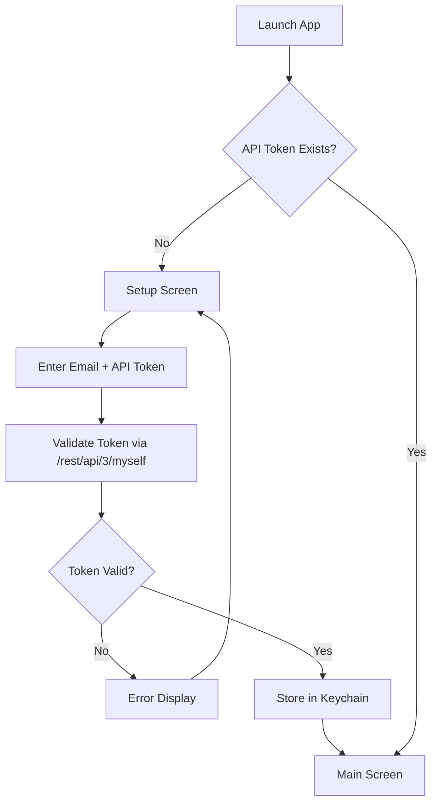

# Product Details

## User Workflows

### Application Flow



### First-Time Setup

Users without a stored Jira API token see the setup screen:

```
┌─────────────────────────────────────────────────────────────────────────┐
│                                                                         │
│                           ╔═══════════════════╗                         │
│                           ║    gojira-tmux    ║                         │
│                           ╚═══════════════════╝                         │
│                                                                         │
│                         First-Time Setup                                │
│                                                                         │
│         ┌─────────────────────────────────────────────┐                 │
│         │                                             │                 │
│         │   Jira API Token not configured.            │                 │
│         │                                             │                 │
│         │   To generate a token:                      │                 │
│         │   1. Visit id.atlassian.com/manage-profile  │                 │
│         │   2. Go to Security > API tokens            │                 │
│         │   3. Create and copy your token             │                 │
│         │                                             │                 │
│         │   Enter Jira API Token: _______________     │                 │
│         │                                             │                 │
│         └─────────────────────────────────────────────┘                 │
│                                                                         │
│         Token will be stored securely in system keychain                │
│         Press Esc to cancel                                             │
│                                                                         │
└─────────────────────────────────────────────────────────────────────────┘
```

## Main Screen Layout

```
┌─────────────────────────────────────────────────────────────────────────┐
│  [Project ▼]          [Member ▼]           [Status ▼]                   │
│   -All-                -All-                All                         │
├─────────────────────────────────────────────────────────────────────────┤
│ ● │ Key      │ Summary            │ Status  │ Assignee │ Pri  │ Due    │
│───┼──────────┼────────────────────┼─────────┼──────────┼──────┼────────│
│ 🔴│ PROJ-123 │ Fix login bug      │ Open    │ J.Doe    │ High │ 01/15  │
│ 🟡│ PROJ-124 │ Add dark mode      │ Open    │ J.Smith  │ Med  │  --    │
│   │ PROJ-125 │ Update docs        │ Ready   │ B.Wilson │ Low  │ 01/20  │
│   │ PROJ-126 │ API refactor       │ In Test │ J.Doe    │ High │ 01/18  │
├─────────────────────────────────────────────────────────────────────────┤
│ PROPERTIES                        │ COMMENTS                            │
│───────────────────────────────────│─────────────────────────────────────│
│ Reporter:    Admin User           │ [2024-01-10] J.Smith:               │
│ Created:     2024-01-05           │   "Updated the PR, ready for..."    │
│ Description:                      │                                     │
│   The login page has an issue     │ [2024-01-08] J.Doe:                 │
│   when users attempt to...        │   "Found the root cause..."         │
│ Sprint:      Sprint 23            │                                     │
│ Epic:        Authentication       │ [2024-01-05] Admin:                 │
│ Labels:      bug, urgent          │   "Created from support ticket"     │
│ Story Points: 5                   │                                     │
└─────────────────────────────────────────────────────────────────────────┘
```

## UI Components

### Filter Bar

| Component | Options | Behavior |
|-----------|---------|----------|
| Project | `-All-` + configured projects | Filters tickets by project key |
| Member | `-All-` + configured team members | Filters by assignee email |
| Status | `All` + named filter groups + live Jira status names | Filters by ticket status |

Filter selections are persisted to `config.yaml` and restored on next launch.

#### Status Filter Groups

Named filter groups appear at the top of the Status dropdown (after `All`) and each expand to a multi-status JQL condition. Groups are defined in `config.yaml` under `status_filters`. If the section is omitted, the following built-in defaults are used:

| Group | Statuses |
|-------|---------|
| `-Open-` | Ready for Work, In Progress, On Hold, Escalated |
| `-Active-` | In Progress, Escalated, Testing in Progress |

Custom groups can be added, renamed, or removed to match your team's Jira workflow. Defining `status_filters:` in the config replaces the defaults entirely.

### Tickets Table

| Column | Description |
|--------|-------------|
| Issues | Three attention indicator dots (red/yellow/cyan) |
| Key | Jira issue key (e.g., PROJ-123) |
| Summary | Issue title (truncated to fit) |
| Status | Current workflow status (truncated to fit) |
| Priority | Issue priority |
| Assignee | Assigned team member |
| Due Date | Expected completion date (YYYY-MM-DD or "none") |
| Last Comment | Relative time since last comment (e.g., "3d ago") |
| Labels | Comma-separated issue labels |

### Attention Indicators

Three independent dots are shown per row (red, yellow, cyan). Each is filled (●) when active or empty (○) otherwise.

| Indicator | Condition |
|-----------|-----------|
| 🔴 Red | No owner comment in 14+ days (stale) |
| 🟡 Yellow | No due date set |
| 🔵 Cyan | Due date has passed (overdue) |

### Properties Panel

Displays fields not shown in main table:
- Reporter
- Created date
- Description
- Sprint
- Epic Link
- Labels
- Story Points

### Comments Panel

- All comments for selected issue
- Sorted newest to oldest
- Format: `[YYYY-MM-DD] Author: "text..."`

## Keyboard Navigation

### Tickets Table

| Key | Action |
|-----|--------|
| `↑` / `k` | Move selection up |
| `↓` / `j` | Move selection down |
| `g` / `Home` | Jump to first row |
| `G` / `End` | Jump to last row |
| `f` / `PgDn` / `Space` | Page down |
| `b` / `PgUp` | Page up |
| `Enter` | View issue details |
| `Tab` | Switch focus to filter bar |
| `r` | Refresh |
| `q` | Quit |

### Filter Bar

| Key | Action |
|-----|--------|
| `←` / `h` | Focus previous dropdown |
| `→` / `l` | Focus next dropdown |
| `Enter` / `Space` | Open dropdown list |
| `↑` / `↓` | Navigate dropdown options (when open) |
| `Enter` | Confirm selection (when open) |
| `Esc` | Close dropdown / return to table |
| `Tab` | Switch focus back to table |

### Detail View

| Key | Action |
|-----|--------|
| `↑` / `↓` | Scroll properties or comments |
| `Tab` | Switch between properties and comments panels |
| `Esc` | Return to ticket list |
| `q` | Quit |

## Configuration

### config.yaml Structure

```yaml
atlassian:
  url: "https://company.atlassian.net"
  email: "your-email@company.com"
  custom_fields:  # optional
    sprint: "customfield_10020"
    epic: "customfield_10014"

projects:
  - key: "PROJ1"
    name: "Project One"
  - key: "PROJ2"
    name: "Project Two"

team:
  - name: "John Doe"
    email: "john.doe@company.com"
    alias: "JohnD"  # optional
  - name: "Jane Smith"
    email: "jane.smith@company.com"

# Optional: define named status filter groups for the Status dropdown.
# If omitted, built-in defaults (-Open- and -Active-) are used.
status_filters:
  - name: "-Open-"
    statuses:
      - "Ready for Work"
      - "In Progress"
      - "On Hold"
      - "Escalated"
  - name: "-Active-"
    statuses:
      - "In Progress"
      - "Escalated"
      - "Testing in Progress"
  # Add custom groups as needed:
  # - name: "-My Work-"
  #   statuses:
  #     - "In Progress"
  #     - "In Review"
```

## Related Documentation

- [Product Summary](./product-summary.md) - High-level vision
- [Technical Details](./technical-details.md) - Architecture and APIs
