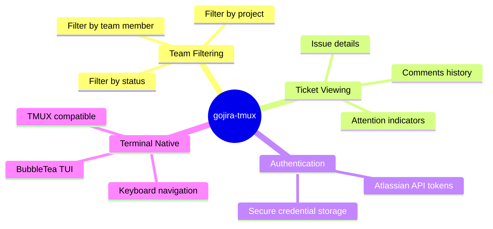

# Product Summary

## Vision

gojira-tmux is a terminal-based Jira viewer designed for development teams. It provides real-time access to Jira tickets directly from the command line, enabling developers to monitor and manage work without leaving their terminal workflow.

## Target Users

- Development teams using Jira for project management
- Developers who prefer terminal-based workflows
- Teams using TMUX or similar terminal multiplexers

## Core Features

### Team-Based Ticket Filtering

Filter Jira tickets by:
- **Team member**: Select by name or alias, filter by email
- **Project**: Choose from configured projects
- **Status**: All, Open, Ready, In Test, Done

### Attention Indicators

Visual flags for tickets requiring attention:
- **Red dot**: Open issue with no owner comment in 14+ days
- **Yellow dot**: Open issue with no due date set

### Atlassian API Token Authentication

- **API access**: Atlassian API tokens for REST calls (Basic Auth)
- **Token validation**: Verified against `/rest/api/3/myself` endpoint
- **Secure storage**: Tokens stored in OS keychain

## Technology Stack

| Component | Technology |
|-----------|------------|
| Language | Go (latest stable) |
| TUI Framework | BubbleTea |
| Jira Client | go-jira |
| Auth | Atlassian API tokens (Basic Auth) |
| Distribution | GitHub Packages |

## Related Documentation

- [Product Details](./product-details.md) - UI specifications, workflows
- [Technical Details](./technical-details.md) - Architecture, APIs, data flows
- [Product Research](./product-research.md) - Initial research and design decisions
