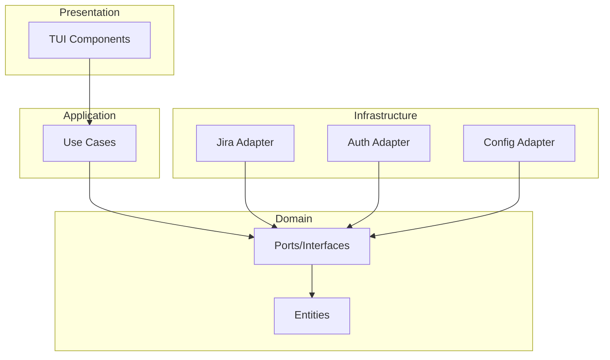
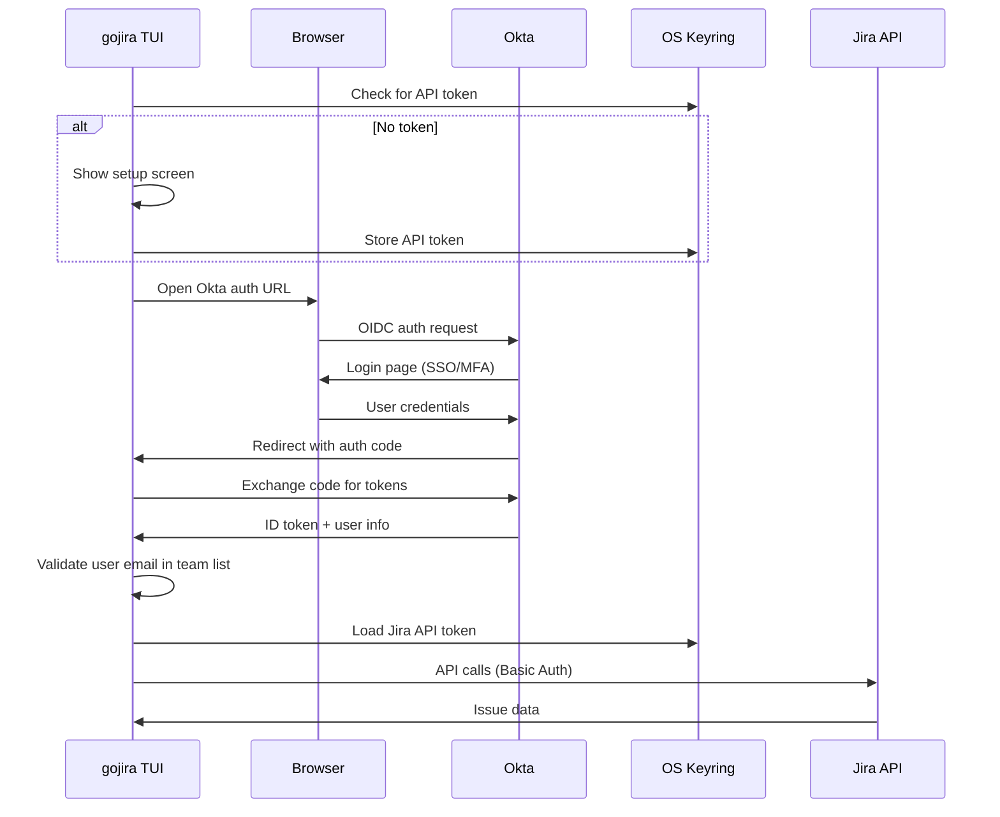
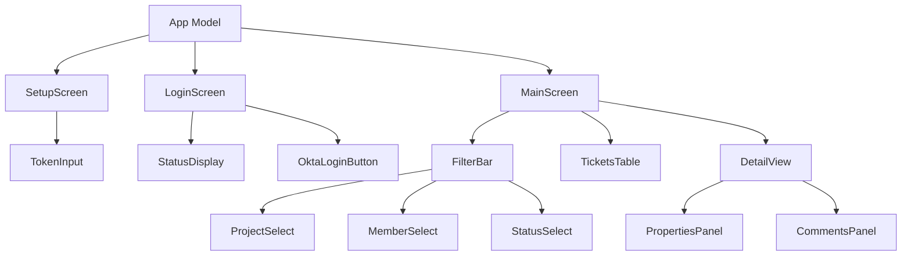
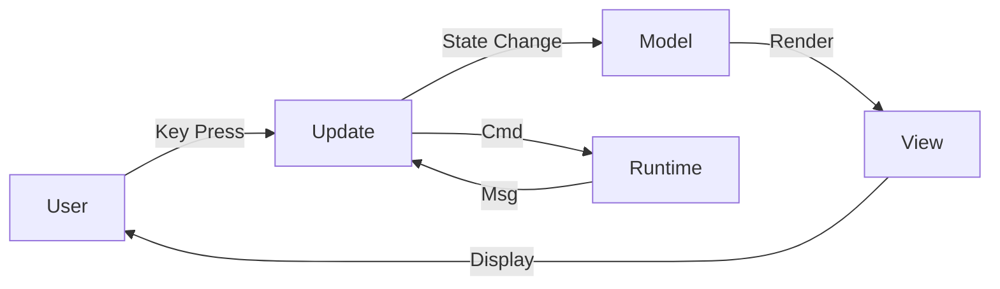

# Technical Details

## Architecture

### Clean Architecture



### Directory Structure

```
cmd/
  gojira/
    main.go                 # Application entrypoint

internal/
  domain/
    issue.go                # Issue entity
    project.go              # Project entity
    team_member.go          # TeamMember entity
    user.go                 # Authenticated user entity
    ports.go                # Interface definitions

  usecase/
    list_issues.go          # List/filter issues
    get_issue_details.go    # Get issue with comments
    authenticate.go         # Authentication orchestration

  adapter/
    auth/
      okta.go               # Okta OIDC implementation
      token_store.go        # Keyring storage
      callback.go           # OAuth callback server
    config/
      config.go             # YAML loading
      types.go              # Config structs
    jira/
      client.go             # go-jira wrapper
      search.go             # JQL query builder

  infrastructure/
    tui/
      app.go                # Root BubbleTea model
      setup_screen.go       # Token setup UI
      login_screen.go       # Okta login UI
      main_screen.go        # Main ticket view
      filter_bar.go         # Filter dropdowns
      tickets_table.go      # Issue list table
      properties_panel.go   # Issue properties
      comments_panel.go     # Issue comments
      styles.go             # lipgloss styles
      keys.go               # Key bindings

pkg/                        # Public reusable packages
```

## Authentication Architecture

### Dual Authentication Flow



### Okta OIDC Configuration

| Parameter | Value |
|-----------|-------|
| Protocol | OpenID Connect |
| Flow | Authorization Code + PKCE |
| Scopes | `openid`, `profile`, `email` |
| Callback | `http://localhost:{port}/callback` |

### Jira API Authentication

```
Authorization: Basic base64(username:api_token)
```

### Secure Storage

| Platform | Storage Backend |
|----------|-----------------|
| macOS | Keychain |
| Linux | Secret Service (libsecret) |
| Windows | Credential Manager |

**Stored Keys:**
- `gojira-jira-token` - Jira API token
- `gojira-okta-refresh` - Okta refresh token (optional)

## Jira API Integration

### Endpoints Used

| Endpoint | Method | Purpose |
|----------|--------|---------|
| `/rest/api/2/search` | GET | JQL queries |
| `/rest/api/2/project` | GET | List projects |
| `/rest/api/2/issue/{key}` | GET | Issue details |
| `/rest/api/2/issue/{key}/comment` | GET | Issue comments |

### JQL Query Patterns

**Filter by assignee:**
```
assignee = "{email}" ORDER BY updated DESC
```

**Filter by project:**
```
project = "{key}" ORDER BY updated DESC
```

**Filter by status:**
```
status = "{status}" ORDER BY updated DESC
```

**Combined filter:**
```
assignee = "{email}" AND project = "{key}" AND status = "{status}" ORDER BY updated DESC
```

### Status Mappings

| UI Filter | JQL Status |
|-----------|------------|
| All | (no filter) |
| Open | `"Open"` |
| Ready | `"Ready for Development"` |
| In Test | `"In Test"` |
| Done | `"Done"` |

## BubbleTea Component Architecture

### Component Hierarchy



### Message Flow



### State Management

Each screen maintains its own model state:

```go
type MainScreenModel struct {
    filterBar      FilterBarModel
    ticketsTable   TicketsTableModel
    detailView     DetailViewModel
    selectedIssue  *domain.Issue
    issues         []domain.Issue
    loading        bool
    err            error
}
```

## Data Entities

### Issue

```go
type Issue struct {
    Key         string
    Summary     string
    Description string
    Status      string
    Priority    string
    Assignee    *TeamMember
    Reporter    *TeamMember
    DueDate     *time.Time
    Created     time.Time
    Updated     time.Time
    Sprint      string
    Epic        string
    Labels      []string
    StoryPoints int
    Comments    []Comment
}
```

### TeamMember

```go
type TeamMember struct {
    Name  string
    Email string
}
```

### Comment

```go
type Comment struct {
    Author    string
    Body      string
    Created   time.Time
}
```

## Dependencies

| Package | Purpose |
|---------|---------|
| `charmbracelet/bubbletea` | TUI framework |
| `charmbracelet/lipgloss` | Styling |
| `charmbracelet/bubbles` | UI components |
| `andygrunwald/go-jira` | Jira REST client |
| `coreos/go-oidc` | Okta OIDC |
| `zalando/go-keyring` | Secure storage |
| `gopkg.in/yaml.v3` | Config parsing |

## Related Documentation

- [Product Summary](./product-summary.md) - High-level vision
- [Product Details](./product-details.md) - UI specifications
- [AGENTS.md](../AGENTS.md) - Development practices
