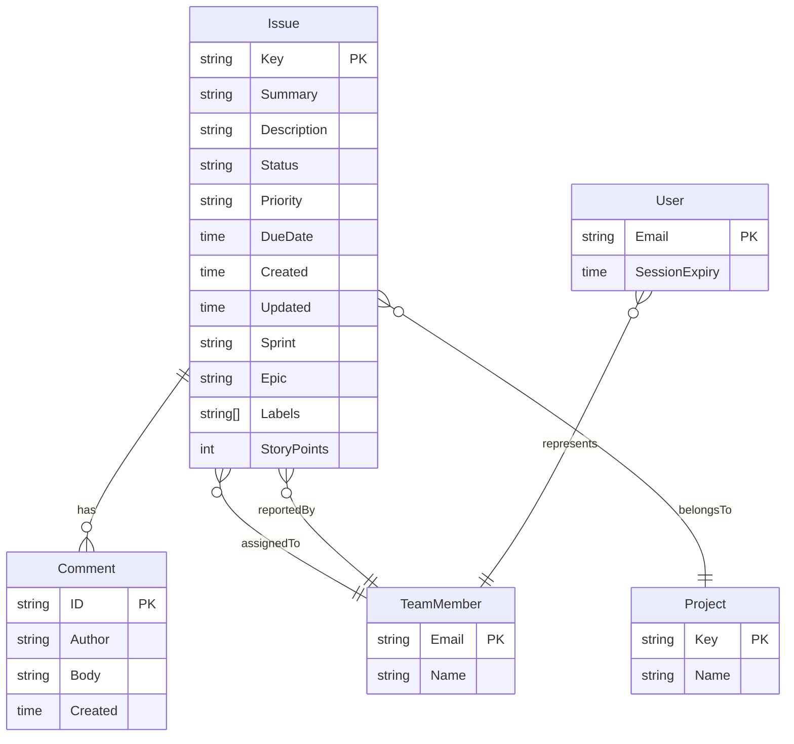
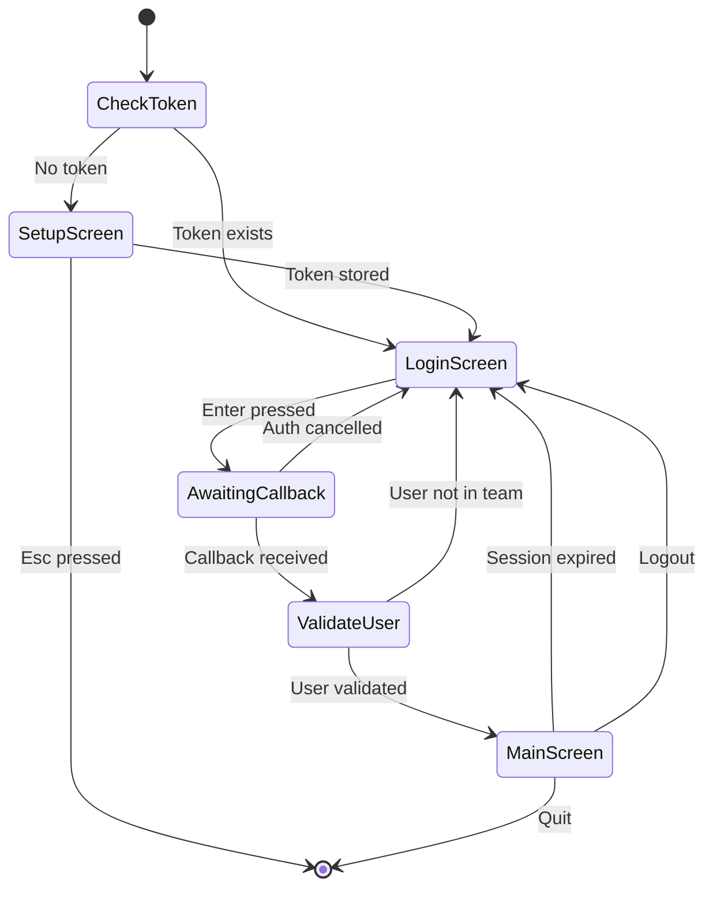

# Data Model: gojira-tmux TUI Application

**Date**: 2026-01-01
**Feature**: [spec.md](./spec.md)

## Overview

This document defines the domain entities, their fields, relationships, and validation rules for the gojira-tmux application.

---

## Entity Diagram



---

## Entities

### Issue

Represents a Jira ticket.

| Field | Type | Required | Description | Source |
|-------|------|----------|-------------|--------|
| Key | string | Yes | Unique Jira key (e.g., "PROJ-123") | Jira API |
| Summary | string | Yes | Issue title/summary | Jira API |
| Description | string | No | Full issue description | Jira API |
| Status | string | Yes | Workflow status | Jira API |
| Priority | string | No | Priority level (High/Medium/Low) | Jira API |
| Assignee | *TeamMember | No | Assigned team member | Jira API |
| Reporter | *TeamMember | No | Issue creator | Jira API |
| DueDate | *time.Time | No | Expected completion date | Jira API |
| Created | time.Time | Yes | Creation timestamp | Jira API |
| Updated | time.Time | Yes | Last update timestamp | Jira API |
| Sprint | string | No | Sprint name | Jira custom field |
| Epic | string | No | Epic link/name | Jira custom field |
| Labels | []string | No | Issue labels | Jira API |
| StoryPoints | int | No | Estimation points | Jira custom field |
| Comments | []Comment | No | Issue comments | Jira API |

**Validation Rules:**
- Key must match pattern `^[A-Z]+-\d+$`
- Summary must be non-empty
- Status must be one of: Open, Ready for Development, In Test, Done (or mapped equivalent)
- Created and Updated must be valid timestamps

**Computed Properties:**

```go
// NeedsAttention returns the attention indicator type
func (i *Issue) NeedsAttention() AttentionType {
    if i.Status != "Open" {
        return AttentionNone
    }

    // Check for stale (no assignee comment in 14+ days)
    if i.IsStale() {
        return AttentionStale // Red dot
    }

    // Check for missing due date
    if i.DueDate == nil {
        return AttentionNoDueDate // Yellow dot
    }

    return AttentionNone
}

// IsStale returns true if assignee hasn't commented in 14+ days
func (i *Issue) IsStale() bool {
    if i.Assignee == nil {
        return false
    }

    lastAssigneeComment := i.LastAssigneeComment()
    if lastAssigneeComment == nil {
        // No assignee comment ever - check if issue is older than 14 days
        return time.Since(i.Created) > 14*24*time.Hour
    }

    return time.Since(lastAssigneeComment.Created) > 14*24*time.Hour
}

// LastAssigneeComment returns the most recent comment by the assignee
func (i *Issue) LastAssigneeComment() *Comment {
    if i.Assignee == nil {
        return nil
    }
    for j := len(i.Comments) - 1; j >= 0; j-- {
        if i.Comments[j].Author == i.Assignee.Name {
            return &i.Comments[j]
        }
    }
    return nil
}
```

**Attention Types:**

```go
type AttentionType int

const (
    AttentionNone      AttentionType = iota // No indicator
    AttentionNoDueDate                       // Yellow dot
    AttentionStale                           // Red dot (takes precedence)
)
```

---

### TeamMember

Represents a team member for filtering and display.

| Field | Type | Required | Description | Source |
|-------|------|----------|-------------|--------|
| Name | string | Yes | Display name | config.yaml |
| Email | string | Yes | Email address (used for Jira assignee filter) | config.yaml |

**Validation Rules:**
- Name must be non-empty
- Email must be valid email format

```go
type TeamMember struct {
    Name  string `yaml:"name" json:"name"`
    Email string `yaml:"email" json:"email"`
}

func (t *TeamMember) Validate() error {
    if t.Name == "" {
        return errors.New("team member name is required")
    }
    if !isValidEmail(t.Email) {
        return errors.New("team member email is invalid")
    }
    return nil
}
```

---

### Project

Represents a Jira project.

| Field | Type | Required | Description | Source |
|-------|------|----------|-------------|--------|
| Key | string | Yes | Jira project key (e.g., "PROJ") | config.yaml |
| Name | string | Yes | Display name | config.yaml |

**Validation Rules:**
- Key must match pattern `^[A-Z]+$` (uppercase letters only)
- Name must be non-empty

```go
type Project struct {
    Key  string `yaml:"key" json:"key"`
    Name string `yaml:"name" json:"name"`
}

func (p *Project) Validate() error {
    if !regexp.MustCompile(`^[A-Z]+$`).MatchString(p.Key) {
        return fmt.Errorf("project key %q must be uppercase letters only", p.Key)
    }
    if p.Name == "" {
        return errors.New("project name is required")
    }
    return nil
}
```

---

### Comment

Represents a Jira issue comment.

| Field | Type | Required | Description | Source |
|-------|------|----------|-------------|--------|
| ID | string | Yes | Comment ID | Jira API |
| Author | string | Yes | Author display name | Jira API |
| Body | string | Yes | Comment text | Jira API |
| Created | time.Time | Yes | Creation timestamp | Jira API |

**Validation Rules:**
- ID must be non-empty
- Author must be non-empty
- Created must be valid timestamp

```go
type Comment struct {
    ID      string    `json:"id"`
    Author  string    `json:"author"`
    Body    string    `json:"body"`
    Created time.Time `json:"created"`
}
```

---

### User

Represents the authenticated user session.

| Field | Type | Required | Description | Source |
|-------|------|----------|-------------|--------|
| Email | string | Yes | User email from Okta ID token | Okta OIDC |
| SessionExpiry | time.Time | Yes | When session expires (8 hours from auth) | Computed |

**Validation Rules:**
- Email must be valid email format
- Email must exist in configured team members list

```go
type User struct {
    Email         string    `json:"email"`
    SessionExpiry time.Time `json:"session_expiry"`
}

func (u *User) IsSessionValid() bool {
    return time.Now().Before(u.SessionExpiry)
}

func (u *User) ValidateTeamMembership(team []TeamMember) error {
    for _, m := range team {
        if strings.EqualFold(m.Email, u.Email) {
            return nil
        }
    }
    return fmt.Errorf("user %s is not a member of the configured team", u.Email)
}
```

---

## Configuration Model

### Config

Root configuration loaded from config.yaml.

```go
type Config struct {
    Jira     JiraConfig     `yaml:"jira"`
    Okta     OktaConfig     `yaml:"okta"`
    Projects []Project      `yaml:"projects"`
    Team     []TeamMember   `yaml:"team"`
}

type JiraConfig struct {
    URL          string            `yaml:"url"`
    Username     string            `yaml:"username"`
    CustomFields CustomFieldConfig `yaml:"custom_fields,omitempty"`
}

type CustomFieldConfig struct {
    Sprint      string `yaml:"sprint,omitempty"`
    Epic        string `yaml:"epic,omitempty"`
    StoryPoints string `yaml:"story_points,omitempty"`
}

type OktaConfig struct {
    Issuer       string   `yaml:"issuer"`
    ClientID     string   `yaml:"client_id"`
    CallbackPort int      `yaml:"callback_port"`
    Scopes       []string `yaml:"scopes"`
}
```

**Validation Rules:**

```go
func (c *Config) Validate() error {
    // Jira validation
    if c.Jira.URL == "" {
        return errors.New("jira.url is required")
    }
    if !strings.HasPrefix(c.Jira.URL, "https://") {
        return errors.New("jira.url must use HTTPS")
    }
    if c.Jira.Username == "" {
        return errors.New("jira.username is required")
    }

    // Okta validation
    if c.Okta.Issuer == "" {
        return errors.New("okta.issuer is required")
    }
    if c.Okta.ClientID == "" {
        return errors.New("okta.client_id is required")
    }
    if c.Okta.CallbackPort <= 0 || c.Okta.CallbackPort > 65535 {
        return errors.New("okta.callback_port must be 1-65535")
    }

    // Projects validation (minimum 1)
    if len(c.Projects) == 0 {
        return errors.New("at least one project is required")
    }
    for _, p := range c.Projects {
        if err := p.Validate(); err != nil {
            return fmt.Errorf("project %s: %w", p.Key, err)
        }
    }

    // Team validation (minimum 1)
    if len(c.Team) == 0 {
        return errors.New("at least one team member is required")
    }
    for _, m := range c.Team {
        if err := m.Validate(); err != nil {
            return fmt.Errorf("team member %s: %w", m.Name, err)
        }
    }

    return nil
}
```

---

## Filter State

### IssueFilter

Represents the current filter state for the ticket list.

```go
type IssueFilter struct {
    Project  string // Empty or "-All-" means all projects
    Assignee string // Empty or "-All-" means all assignees
    Status   string // "All", "Open", "Ready", "In Test", "Done"
}

func (f *IssueFilter) IsEmpty() bool {
    return (f.Project == "" || f.Project == "-All-") &&
           (f.Assignee == "" || f.Assignee == "-All-") &&
           (f.Status == "" || f.Status == "All")
}

// ToJQL converts filter state to JQL query
func (f *IssueFilter) ToJQL(projects []Project, team []TeamMember) string {
    builder := NewJQLBuilder()

    // Project filter
    if f.Project != "" && f.Project != "-All-" {
        builder.Project(f.Project)
    } else {
        // All configured projects
        keys := make([]string, len(projects))
        for i, p := range projects {
            keys[i] = p.Key
        }
        builder.Project(keys...)
    }

    // Assignee filter
    if f.Assignee != "" && f.Assignee != "-All-" {
        // Find email for display name
        for _, m := range team {
            if m.Name == f.Assignee {
                builder.Assignee(m.Email)
                break
            }
        }
    }

    // Status filter
    if f.Status != "" && f.Status != "All" {
        builder.Status(f.Status)
    }

    return builder.Build()
}
```

---

## State Transitions

### Application State Machine



---

## Relationships Summary

| From | To | Cardinality | Description |
|------|----|-------------|-------------|
| Issue | Comment | 1:N | Issue has many comments |
| Issue | TeamMember | N:1 | Issue assigned to one member |
| Issue | TeamMember | N:1 | Issue reported by one member |
| Issue | Project | N:1 | Issue belongs to one project |
| User | TeamMember | 1:1 | User corresponds to team member |

---

## Next Steps

1. Generate `contracts/` with port interface definitions
2. Generate `quickstart.md` for developer setup
